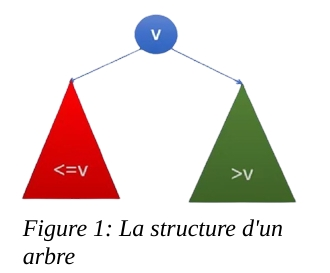
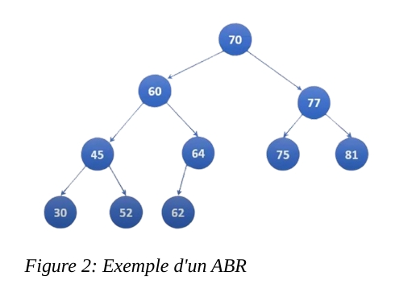
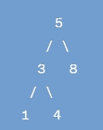
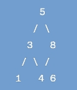
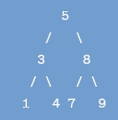
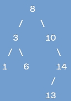
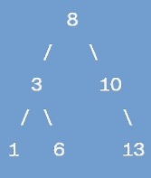

# binary_search_trees
# Implémentation avec les listes chaînées

## 1) Introduction

Les listes chaînées sont des structures de données fondamentales en informatique. Elles permettent de stocker une séquence d'éléments où chaque élément est relié à son successeur par un lien. Elles sont particulièrement flexibles en termes d'insertions et de suppressions d'éléments.

Les listes chaînées peuvent être utilisées pour stocker les éléments d'un dictionnaire. Chaque élément du dictionnaire peut être représenté par un nœud dans la liste chaînée. Les opérations principales du dictionnaire telles que l'insertion, la recherche et la suppression peuvent être réalisées en utilisant (ou en s'inspirant) des fonctions de la liste chaînée.

## 2) Les principales méthodes utilisées

### 1. Méthode `ajouteTete`
La méthode `ajouteTete` ajoute un nouvel élément en tête du dictionnaire.

- **Vérification** : Si le dictionnaire est vide, l'élément ajouté devient à la fois la tête et la queue du dictionnaire.
- **Ajout** : Si le dictionnaire n'est pas vide, on définit le successeur de l'élément ajouté comme étant l'élément actuellement en tête, puis on met à jour la tête du dictionnaire pour que le nouvel élément devienne la tête.

### 2. Méthode `inserer`
La méthode `inserer` insère un élément à une position spécifiée dans la liste chaînée.

- **Vérification de la position** : Si la position spécifiée est inférieure ou égale à zéro, l'insertion est annulée et un message d'erreur est affiché.
- **Insertion en tête** : Si la position est égale à 1, l'élément est inséré en tête en appelant `ajouteTete`.
- **Insertion à une position spécifique** : Si la position n'est pas la tête, la méthode parcourt la liste jusqu'à la position d'insertion spécifiée. Une nouvelle cellule contenant l'élément à insérer est créée. La cellule précédente est mise à jour pour pointer vers la nouvelle cellule, et la nouvelle cellule pointe vers l'élément suivant.
  - Si la position spécifiée correspond à la fin de la liste, la nouvelle cellule devient la nouvelle queue.
  - Si la position est invalide (par exemple, lorsque la cellule courante est nulle), l'insertion est annulée.

### 3. Méthode `rechercher` & `rechercherRec`
La méthode `rechercher` recherche un élément dans la liste chaînée en fonction d'une clé spécifiée.

- **Vérification de la clé** : Si la clé est nulle, la méthode retourne `null`, indiquant qu'aucun élément correspondant n'a été trouvé.
- **Recherche récursive** : La méthode appelle la méthode privée `rechercherRec`, qui effectue la recherche récursive dans la liste chaînée. Cette méthode prend en paramètre la clé et la cellule de départ de la recherche.
  - Si la clé de la cellule actuelle correspond à la clé recherchée, l'élément est retourné.
  - Sinon, la méthode continue la recherche en appelant récursivement `rechercherRec` sur la cellule suivante.

### 4. Méthode `afficher`
La méthode `afficher` permet de parcourir la liste chaînée et d'afficher le contenu de chaque élément.

- **Parcours** : En démarrant à la tête de la liste, la méthode parcourt chaque élément, en affichant leur contenu à chaque itération.
- **Mise à jour** : Après chaque affichage, la méthode passe à la cellule suivante en mettant à jour la variable de cellule à la cellule suivante, jusqu'à ce que tous les éléments soient parcourus.

### 5. Méthode `supprimer`
La méthode `supprimer` permet de supprimer un élément à une position spécifiée dans la liste chaînée.

- **Vérification de la position** : Si la position spécifiée est inférieure ou égale à zéro, la suppression est annulée.
- **Suppression en tête** : Si la position est égale à 1, l'élément à supprimer est en tête. On appelle la méthode `retireTete`, qui retire l'élément en tête de la liste.
- **Suppression à une position spécifique** : Si la position n'est pas la tête, la méthode parcourt la liste jusqu'à la position spécifiée. Lorsque la position de suppression est atteinte, la cellule précédente est mise à jour pour pointer vers la cellule suivante, et la cellule suivante devient la cellule précédente.
  - Si la cellule à supprimer est la queue, la queue est mise à jour pour pointer vers la cellule précédente, qui devient la nouvelle queue de la liste.
# Les tests sur les temps d’exécution des méthodes :

## ➔ L’insertion 

Nous commençons par la méthode `inserer`, en générant des tableaux de grandes tailles de manière aléatoire pour tester l’efficacité ou le temps d’exécution de l’insertion des éléments dans la liste chaînée. Les tailles des tableaux commencent à 1000 éléments, et nous augmentons progressivement la taille pour observer les variations du temps d’exécution.

### Résultats des tests sur l’insertion :

| **Taille** | **Temps d’exécution en Millisecondes** |
|------------|----------------------------------------|
| 1000       | 1                                      |
| 5000       | 2                                      |
| 10000      | 4                                      |
| 100000     | 12                                     |

On observe que le temps d’exécution augmente de manière proportionnelle avec l'augmentation de la taille de la liste. Le temps moyen d'insertion des éléments dans la liste chaînée est de **2.33 ms**. Cela peut être expliqué par la complexité de l’opération d’insertion dans une liste chaînée, qui est de **O(n)**, car il faut potentiellement parcourir toute la liste pour insérer un nouvel élément à la position souhaitée.

---

## ➔ La suppression :

Pour la suppression des éléments, le temps de suppression augmente de manière significative avec l'augmentation de la taille des éléments à supprimer.

### Résultats des tests sur la suppression :

| **Taille** | **Temps d’exécution en Millisecondes** |
|------------|----------------------------------------|
| 1000       | 39                                     |
| 5000       | 400                                    |
| 10000      | 660                                    |

On remarque que le temps de suppression augmente rapidement avec la taille de la liste. Le temps moyen de suppression pour une liste de 1000 éléments est de **39 millisecondes**, un temps qui peut être jugé relativement lent. Cela montre que la structure de liste chaînée n'est pas la plus efficace pour le traitement de grandes quantités de données, surtout pour les opérations de suppression où il peut être nécessaire de parcourir une grande partie de la liste.

---


- Pour l'insertion, le temps d'exécution augmente de manière linéaire avec la taille du tableau, ce qui est attendu avec une complexité en `O(n)`.
- Pour la suppression, bien que la complexité soit aussi en `O(n)`, le temps d'exécution devient relativement lent dès que la taille des données augmente, rendant la liste chaînée moins adaptée pour des traitements sur de très grandes listes.

# Les arbres binaires de recherche

##  Introduction 

Les arbres binaires de recherche (ABR) sont des structures de données qui permettent de représenter efficacement un grand nombre de données. Ils sont similaires aux listes mais sur des ensembles dynamiques. Un ABR est une structure hiérarchique caractérisée par les éléments suivants :

- **Racine** : Chaque arbre binaire de recherche possède une racine, qui est le nœud principal à partir duquel toutes les autres données sont organisées.
- **Nœuds** : Chaque nœud a au plus deux fils : un fils gauche et un fils droit.

### Principales caractéristiques des ABR :

- **Sous-arbre gauche** : Tous les nœuds du sous-arbre gauche d'un nœud ont une valeur inférieure ou égale à la valeur du nœud.
- **Sous-arbre droit** : Tous les nœuds du sous-arbre droit d'un nœud ont une valeur supérieure à la valeur du nœud.

### La hauteur d'un arbre

La hauteur d'un arbre est égale au **niveau maximum** des nœuds de cet arbre.

### Avantages des ABR

Les arbres binaires de recherche offrent plusieurs avantages, notamment :

- **Efficacité de recherche** : L'ABR permet de stocker les données de manière efficace, ce qui facilite les recherches rapides. Cela est dû à sa structure hiérarchique et à l'organisation des données en fonction des valeurs des nœuds.
  
### Inconvénients des ABR

Cependant, l'ABR présente aussi certains inconvénients, notamment :

- **Arbres dégénérés (ou non équilibrés)** : Un arbre est considéré comme non équilibré ou dégénéré lorsqu'il ne possède qu'un seul sous-arbre (gauche ou droit). Cela réduit son efficacité, car la structure devient similaire à une liste chaînée, et la complexité de recherche peut alors être linéaire.

### Exemple d'un ABR

Prenons l'exemple suivant d'un arbre binaire de recherche :

- Tous les nœuds du **sous-arbre droit** sont supérieurs à la racine (ici la valeur 70).
- Tous les nœuds du **sous-arbre gauche** sont inférieurs à la racine (ici la valeur 70).
 sa hauteur est   3

### Les principaux méthodes utilisées

Tout d’abord, on note qu’on dispose d’une classe `Element` et d’une classe `Noeud`, chaque nœud a une clé (`int`) et un contenu (`double`).

Ensuite, on va présenter les différentes méthodes utilisées dans la classe `ArbreBinaireRech` ainsi que des exemples du déroulement des exécutions des fonctions et l’algorithme associé à chaque méthode. On produit une méthode qui permet d’insérer un élément, supprimer un élément, rechercher un élément et enfin une méthode qui affiche l’ABR en ordre croissant des clés.
___
#### La méthode d’insertion

Lorsqu’on veut insérer un élément, il faut bien respecter les contraintes ou les caractéristiques de l’ABR déjà citées dans l’introduction. Quand on arrive à l’insertion, on distingue deux cas :

- **Cas 1 : L’ABR est vide** : Dans ce cas, le nœud inséré va tout simplement être mis dans la racine.
  
- **Cas 2 : L’arbre n’est pas vide** : Maintenant, on vérifie si l’élément à insérer a une clé plus petite que celle du nœud actuel. Si c’est bien le cas, on descend dans le sous-arbre gauche. Lors du parcours du sous-arbre gauche, si on trouve que ce dernier est vide, on insère directement le nouvel élément, sinon on continue le parcours de manière récursive.

Maintenant, dans l’autre cas où l’élément à insérer a une clé plus grande que celle du nœud actuel, on descend dans le sous-arbre droit. Le même cas s’il est vide : on insère directement l’élément, sinon on continue la recherche de manière récursive dans le sous-arbre droit.

On doit aussi traiter un cas où l’élément qu’on veut insérer a une clé déjà existante dans l’ABR. Dans ce cas, et pour éviter les doublons, on ne fait rien (on affiche un message indiquant que l’élément existe déjà).

Cette méthode consiste à parcourir l’arbre en comparant à chaque fois la clé de l’élément qu’on veut insérer à la clé du nœud courant. On continue la comparaison dans le sous-arbre gauche, sinon dans le sous-arbre droit, jusqu'à trouver un endroit où on peut enfin insérer l’élément.
```text 
 Fonction inserer(noeud, nouvel_element)
    Si noeud est null
        Retourner un nouveau noeud contenant nouvel_element
    Fin Si
    Si (nouvel_element.cle < noeud.element.cle)
        noeud.fils_gauche → inserer(noeud.fils_gauche, nouvel_element)
    Sinon si (nouvel_element.cle > noeud.element.cle)
          noeud.fils_droit → inserer(noeud.fils_droit, nouvel_element)
    Fin Si
    Retourner noeud
 Fin Fonction
```
### Exemple d’éxécution de la fonction :
 On prend l’ABR suivant :



 Dans cet Exemple , nous voulons insérer un élément dans l’ABR avec une clé 6 à travers la fonction insérer , on donne dans ce qui suit les étapes de l’insertion : - on commence avec la racine 5. in compare notre clé avec 5 , comme elle est supérieur à 5 , on se dirige vers le sous sous-arbre droit , maintenant on compare notre clé avec la clé du nœud (8) , 6 inférieur à 8 , donc nous allons partir vers le sous-arbre gauche du nœud 8 .
  Enfin dans le sous-arbre gauche de 8 , il n’ya pas de nœud , donc nous insérons le nouvel élément dans cet emplacement . Et on obtient le résultat suivant 


___
### La méthode de recherche
 la méthode rechercher est utilisée pour rechercher un élément dans l’ABR , à travers cette méthode 
on fait appel à une méthode récursive qui va effectuer la recherche dans l’arbre d’une manière 
récursive dans l’arbre en comparant la valeur donnée avec les clés des nœuds, on donne 
l’algorithme suivi et on le discute :
```text 
 Fonction rechercher(noeud, valeur)
    Si noeud est null ou que la valeur du nœud est égale à la valeur 
recherchée
        Retourner le nœud actuel
    Fin Si
    Si la valeur recherchée est inférieure à la valeur du nœud actuel
        Appeler récursivement rechercher avec le sous-arbre gauche comme 
argument
    Sinon
        Appeler récursivement rechercher avec le sous-arbre droit comme 
argument
    Fin Si
 Fin Fonction
```
La fonction prend en entrée deux paramètres : un nœud , il s’agit du nœud actuel à partir duquel on commence la recherche , à chaque appel récursif de la fonction , on va passer le nœud suivant soit du sous-abre gauche ou droit en fonction de la comparaison entre lélement recherché et le nœud actuel. Le deuxième paramètre , c’est la valeur que nous recherchons dans l’arbre , on compare cette valeur avec la valeur du nœud actuel pour décider dans quel sous-arbre on poursuit la 
recherche. La fonction ‘rechercher’ commence par vérifier si le nœud actuel est nul ou si la valeur du nœud est égale à la valeur recherchée . Si c’est le cas , elle retourne ce nœud puisqu’on a trouvé la valeur recherchée , Ensuite , on vérifie si la valeur recherchée inférieure à la valeur du nœud actuel . Si c’est le cas , on appelle récursivement la focntion ‘rechercher’ avec le sous-arbre gauche comme argument , car la valeur recherchée peut se trouver dans ce sous-arbre. Sinon , on appelle la fonction ‘rechercher’ avec le sous-arbre droit comme argument , car la  valeur recherchéepeut se trouver dans ce sous-arbre . Enfin on sort avec un bon résultat de recherche. Soit on trouve la valeur recherchée ou qu’on atteigne un nœud nul , qui indique que la valeur n’est pas présente dans l’ABR

+ Exemple d’éxécution de la fonction rechercher:


 On veut rechercher l’élément avec la valeur 7 dans cet arbre :
 - Nous commençons par la racine de l’arbre , qui a la valeur 5 , on compare la valeur 7 avec la valeur de la racine , comme 7 est supérieur à la racine , nous allons continuer la recherche dans le sous-arbre droit . Maintenant , nous sommes au nœud avec la valeur 8 , on compare la valeur recherchée avec le nœud actuel , comme 7 est inférieur à 8 , nous allons dans le sous-arbre gauche ,on arrive maintenant au nœud avec la valeur 7 , et c’est la valeur recherchée , et donc la fonction a finit son travail en renvoyant la valeur recherchée.
 + La méthode de suppression:
 La méthode de suppression dans l’ABR prend en entrée un nœudracine et un élément à supprimer , on utilise une approche récursive pour supprimer l’élément en tenant en compte les différents cas de suppression possibles , on laisse ci-dessous l’algorithme suivi pour supprimer un élément et on l’explique après sa présentation :
 ```text 
 fonction supprimer(n: Noeud, e: Elements) -> Noeud:
    si n est vide:
        retourner n
    sinon si e.cle < n.element.cle:
        n.filsGauche →supprimer(n.filsGauche, e)
    sinon si e.cle > n.element.cle:
        n.filsDroit → supprimer(n.filsDroit, e)
    sinon:
         si n.filsGauche est vide:
            retourner n.filsDroit
        sinon si n.filsDroit est vide:
            retourner n.filsGauche
        sinon:
            apres → n.filsDroit
        tant que apres.filsGauche n'est pas vide:
                apres → apres.filsGauche
                n.element → apres.element
                n.filsDroit → supprimer(n.filsDroit, apres.element)
 retourner n
 ```
### Explication d’algo 
 la méthode supprimer() , prend un nœud n  et un élément e à supprimer de l’arbre ,si n est vide , cela signifie que l’élément n’a pas été trouvé dans l’arbre et nous reoturnons simplement n.
 si la clé de l'élément que nous voulons supprimer est inférieure à la clé du nœud actuel, cela signifie que l'élément recherché se situe probablement dans le sous-arbre gauche de ce nœud. Pour garantir la cohérence de notre recherche, nous réappliquons la fonction supprimer() sur le sous-arbre gauche en tant que nœud actuel. Cela permet de poursuivre la recherche de l'élément à supprimer dans ce sous-arbre gauche de manière récursive jusqu'à ce que l'élément soit trouvé ou que l'on atteigne un nœud terminal (une feuille) qui ne contient pas l'élément recherché. lorsque la clé de l'élément que nous souhaitons supprimer est supérieure à la clé du nœud actuel, cela signifie que l'élément recherché se trouve probablement dans le sous-arbre droit de ce nœud , ensuite on suit les mêmes étapes pour le 
sous-arbre gauche. lorsque la clé de l'élément à supprimer est égale à la clé du nœud actuel, nous devons prendre en considération les différents caspour que l'arbre reste un arbre binaire de recherche valide après la suppression. 
Si le sous-arbre gauche est vide , cela veut dire que le nœud à supprimer n’a qu’un fils à droite , dans ce cas , on peut retourner le sous-arbre droit pour réorganiser correctement l’arbre . Dans le cas contraire où le le sous-arbre droit est vide , on procède de la même façon.
 Si le nœud à supprimer à deux fils , on doit trouver son succeseur , pour faire ça on recherche le nœud le plus à gauche dans le sous-arbre droit ,ce nœud est celui qui remplace le nœud à supprimer .on remplace donc la clé du nœud à supprimer par celle du nœud successeur, et enfin on supprime le nœud successeur du sous-arbre droit pour maintenir la validité de l’ABR.
 Et comme ça , on garantit que l’abr reste bien ordonné après chaque suppression , tout en conservant les propriétés de cette structure.

 +  Exemple d’éxécution de la fonction supprimer:
 
 
 dans cet exemple  on veut supprimer le nœud contenant la clé 14 , On voit comment la méthode supprimer() fonctionne :
 on commence par comparer la clé à supprimer (14) avec la clé de la racine (8) , comme 14 est supérieur à 8 , nous nous déplaçons vers le sous-arbre droit.
 Ensuite, on compare 14 avec la clé de 10 , comme 14 est supérieur à 10 , on se déplace vers le sous-arbre droit de 10. Maintenant , nous comparons 14  avec la clé 14 , comme les clés sont égales , nous avons bien trouvé le nœud à supprimer.
 Comme le nœud 14 a un seul fils gauche , n le rempalce simplement par son fils gauche (13).
 après la suppression l’ABR devient :

 
 
 +  La méthode d’affichage:
 On utilise une méthode afficher  pour parcourir un arbre binaire de recherche en utilisant un parcours infixe. En prenant la racine de l'arbre comme paramètre, cette méthode explore l'arbre en 
suivant un schéma précis : on commence par se déplacer récursivement vers le sous-arbre gauche, ce qui permet d'afficher tous les éléments du sous-arbre gauche dans l'ordre croissant de leurs clés. 
Ensuite, elle affiche la clé et le contenu de la racine actuelle. Enfin, elle se déplace récursivement vers le sous-arbre droit, affichant ainsi tous les éléments du sous-arbre droit dans l'ordre croissant de 
leurs clés. Ainsi, en appelant simplement la méthode  avec la racine de l'arbre, tous les éléments de l'arbre seront présentés dans un ordre croissant de leurs clés, ce qui est conforme au comportement 
attendu d'un arbre binaire de recherche. 

___
### 3) Les tests sur les temps d’exécution des méthodes :

#### Les tests sur l’insertion :

On utilise la méthode de génération aléatoire des clés et des valeurs pour pouvoir tester la méthode d’insertion sur des grandes tailles et pouvoir sortir avec des conclusions et des explications relatives aux réponses des fonctions avec les données de grande taille.

On présente dans un tableau le temps nécessaire à l’insertion pour les différentes tailles.

| Taille   | Temps d’exécution en Millisecondes |
|----------|-----------------------------------|
| 1000     | 1                                 |
| 5000     | 3                                 |
| 10000    | 4                                 |
| 100000   | 40                                |

On voit que le temps d’exécution nécessaire pour l’insertion augmente à mesure que la taille augmente. On trouve aussi que le temps moyen d’insertion pour 1000 éléments est de 2.00 Millisecondes (on note que l’insertion des éléments pour lesquels on calcule le temps d’insertion se fait après l’insertion des 10000 premiers éléments, de manière à ce que l’arbre soit équilibré), un temps qui reste raisonnable et même on peut dire qu’il est trop bon. Ce temps obtenu est lié à plusieurs facteurs, dont la complexité de la méthode utilisée, notamment la structure liée à l’arbre binaire de recherche, et aussi l’équilibrage de l’arbre. Plus un arbre est équilibré, plus le temps d’insertion est faible.

#### Les tests sur la suppression des éléments :

On passe maintenant à la suppression des éléments. On procède de la même façon, en augmentant la taille à chaque fois tout en suivant la variation du temps d’exécution.

On présente dans le tableau ci-dessous les résultats.
| Taille   | Temps d’exécution en Millisecondes |
|----------|-----------------------------------|
| 1000     | 2,5                               |
| 5000     | 4                                 |
| 10000    | 7                                 |
| 15000    | 12                                |
| 20000    | 40                                |
| 25000    | 45                                |
| 30000    | 54                                |

On voit que le temps nécessaire à la suppression des éléments augmente lui aussi avec l’augmentation de la taille. On peut lier cette augmentation aussi au fait que les éléments qu’on a choisis de supprimer sont choisis d’une façon aléatoire, donc le temps de suppression dépend notamment de cette donnée.

Ainsi, on peut conclure que le temps moyen de suppression dans un intervalle de 10000 éléments est de 4.67 Millisecondes.

Un temps moyen de suppression qui reste logique et raisonnable puisqu’il dépend de différents facteurs, tels que la structure de l’ABR (s’il est équilibré ou pas), le nombre de nœuds à supprimer. À titre d’exemple, si l’arbre contient beaucoup de nœuds à supprimer, le temps de suppression moyen sera plus élevé en raison du nombre d’opérations à effectuer. Il y a aussi le point que l’on a déjà cité, qui est le choix aléatoire des éléments à supprimer.

**NB** : On souligne que le temps moyen d’insertion et de suppression est pris pour un intervalle de 10000 éléments et non pour toutes les données présentes dans le tableau.
## La comparaison entre les deux structures

### 1) La comparaison de l’insertion :
Le temps d'exécution nécessaire pour l'insertion dans un ABR augmente à mesure que la taille des données augmente, ce qui est une observation courante dans les opérations d'insertion. Le temps moyen d'insertion pour un ensemble de 10 000 éléments est de **3.67 millisecondes**, et le temps moyen d'insertion dans une liste chaînée est estimé à **2.33 millisecondes** pour un ensemble de 10 000 éléments. 

Cette valeur peut être expliquée par la complexité de l'opération d'insertion dans une liste chaînée, qui ajoute l’élément dans la tête de la liste. Les résultats obtenus sont cohérents avec la hauteur de l'arbre et la longueur de la liste chaînée.

Ces résultats obtenus sont cohérents avec la hauteur de l'arbre. Dans le cas de l'arbre binaire de recherche (ABR), le temps d'insertion augmente avec la taille des données en raison de la nécessité de parcourir l'arbre pour trouver la bonne position d'insertion. La hauteur de l'arbre dépend de plusieurs facteurs, y compris l'équilibre de l'arbre, qui peut être influencé par l'ordre d'insertion des éléments. Une hauteur plus grande de l'arbre peut entraîner des temps d'insertion plus longs, car il faudra parcourir plus de niveaux pour trouver la position d'insertion. Cela explique le temps d'insertion plus élevé observé pour l'ABR par rapport à la liste chaînée.

D'autre part, dans le cas de la liste chaînée, le temps d'insertion dépend principalement de la position où l'élément est inséré dans la liste. Comme chaque élément est ajouté au début de la liste dans notre cas, le temps d'insertion reste relativement constant, ce qui est cohérent avec le temps moyen d'insertion observé pour la liste chaînée.

Enfin, on peut conclure que les résultats obtenus sont cohérents avec la hauteur de l'arbre et la longueur de la liste chaînée, et ils montrent comment ces facteurs influent sur les performances des opérations d'insertion.

### 2) La comparaison de la suppression :
Pour la liste chaînée, le temps moyen de suppression est de **39 millisecondes**. Ce temps est significativement plus élevé en raison de la complexité linéaire de la suppression dans une liste chaînée, ce qui signifie que plus la liste est longue, plus le temps de suppression est long.

Pour l'ABR, le temps moyen de suppression est de **4.67 millisecondes**. Cela est dû à la nature logarithmique de la structure, ce qui signifie que le temps nécessaire pour supprimer un élément reste relativement constant même lorsque la taille de l'arbre augmente.

Cette différence entre les temps de suppression des deux structures met en évidence l'efficacité de l'ABR par rapport à la liste chaînée pour les opérations de suppression, en particulier lorsque le nombre d'éléments est important. La performance supérieure de l'ABR est principalement due à sa structure équilibrée, qui garantit des temps de recherche et de suppression efficaces, même pour de grandes quantités de données.

En conclusion, les résultats observés correspondent aux attentes en termes de complexité algorithmique des deux structures de données, démontrant l'avantage de l'ABR sur la liste chaînée pour les opérations de suppression dans des ensembles de données volumineux.


